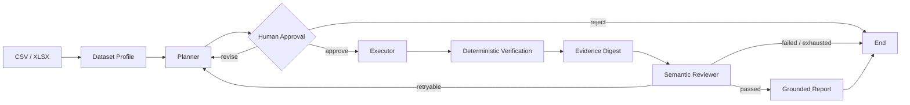

# DataPilot

> A durable, human-governed and evidence-grounded data analysis agent.

[](https://www.python.org/)
[](https://www.langchain.com/langgraph)
[](https://modelcontextprotocol.io/)
[](https://fastapi.tiangolo.com/)
[](https://github.com/tykhed666-lab/DataPilot/actions)
[](LICENSE)
[](https://m8ven.ai/mcp/tykhed666-lab-datapilot-1wz3x3?s=readme)

DataPilot 是一个面向结构化数据分析的状态化 Agent 后端。它将数据画像、计划生成、人工审批、工具执行、结果复核与报告交付组织为一条可恢复、可观测、可评测的工作流。

用户上传 CSV 或 XLSX 文件并提出问题后，DataPilot 会生成结构化分析计划，在执行前等待人工确认，通过受控工具完成查询与计算，再结合确定性复算和语义审核生成有证据支撑的答案。任务状态由 Checkpoint 持久化，进程重启后仍可继续执行。

## Workflow



```text
profile → plan → approve → execute → verify → review → report
```

## Capabilities

### Structured planning

Planner 根据数据画像与工具 Schema 生成 Pydantic 校验的 `AnalysisPlan`。工具不存在、参数越界或步骤超出预算时，计划会在进入执行层之前被拒绝。

### Human-in-the-loop

工作流通过 LangGraph `interrupt` 在关键节点暂停，支持 `approve`、`revise` 和 `reject`。审批状态写入 Checkpoint，不依赖进程内等待或临时会话。

### Controlled execution

Executor 按计划动态发现并调用工具。SQLGlot 负责语法树级安全检查，DuckDB 仅暴露受控数据关系，并对查询类型与最大返回行数施加限制。

### Durable recovery

SQLite Checkpoint 保存工作流状态。工具调用使用由任务、计划版本和步骤生成的稳定 `call_id`，恢复执行时可以复用已有产物，避免重复副作用。

### Evidence-grounded review

Reviewer 先对关键结果进行确定性复算，再基于受预算约束的 Evidence Digest 完成语义审核与答案生成。Digest 包含字段、行数、截断状态和有限样本，完整结果不会被复制进模型上下文。

### Bounded correction

可修复错误会在有限预算内触发重新规划；安全错误直接终止；预算耗尽后进入明确失败态。每一次新计划仍需经过人工审批。

### Trace and evaluation

系统记录节点、模型、工具、延迟、Token、重试与最终状态。评测不仅检查最终答案，也验证必须出现或禁止出现的工具轨迹，并支持确定性故障注入。

### MCP tool surface

Dataset 工具共享统一契约，可由进程内 Tool Registry 调用，也可通过独立 MCP 2.x Server 暴露。真实子进程集成测试覆盖工具发现与调用链路。

## Architecture

DataPilot 由六个核心模块组成：

| Module | Responsibility |
|---|---|
| Dataset | 加载 CSV / XLSX、生成数据画像、执行受控 DuckDB 查询 |
| Tool Runtime | 工具注册、发现、输入输出校验与统一错误封装 |
| Agent Graph | 规划、审批、执行、审核、重试与状态路由 |
| Artifact Store | 原子保存工具结果和报告，对工作流只暴露引用 |
| Evidence Packager | 从产物构建受字符预算约束的审核证据 |
| Trace | 记录节点、模型、工具、决策、序号与延迟 |

Web Workbench 是 FastAPI 之上的轻量 Adapter。它通过 `/api/*` 接口组合现有能力，不持有 Agent 状态、模型凭据或分析逻辑。

### State model

AgentState 只保存工作流决策所需的小型信息：

- 任务、数据集和用户问题
- 当前状态、步骤与结构化计划
- 工具结果摘要与 `ArtifactRef`
- Reviewer 结论、答案和重试计数

DataFrame、完整 SQL 结果、Plotly HTML、大型模型原文和本机绝对路径不会进入 AgentState。大型内容由 Artifact Store 管理，从而控制 Checkpoint 体积、序列化风险和模型上下文长度。

### Guardrails

```text
Input Guardrail
→ Plan Guardrail
→ Tool Input Guardrail
→ Tool Execution
→ Tool Output Guardrail
→ Reviewer
→ Report Guardrail
```

## Quick start

环境要求：Python 3.11 与 [uv](https://docs.astral.sh/uv/)。

```powershell
git clone https://github.com/tykhed666-lab/DataPilot.git
cd DataPilot
uv sync --python 3.11
Copy-Item .env.example .env
```

在 `.env` 中配置 OpenAI-compatible API Key、Base URL 和模型 ID：

```dotenv
OPENAI_API_KEY=replace-me
OPENAI_BASE_URL=https://provider.example.com/v1
AGENT_MODEL=replace-me
```

启动服务：

```powershell
uv run datapilot
```

服务启动后可访问：

- Workbench：<http://127.0.0.1:8000>
- OpenAPI：<http://127.0.0.1:8000/docs>
- Health check：<http://127.0.0.1:8000/health/live>

## Usage

### Web Workbench

Workbench 提供完整的交互链路：上传数据集、创建任务、查看计划、提交审批、读取分析报告以及检查 Agent Trace。

### CLI

使用内置示例数据运行一次完整分析：

```powershell
uv run datapilot-demo examples/sales_demo.csv "各区域总收入是多少？" --auto-approve
```

### MCP Server

通过 stdio 启动 Dataset MCP Server：

```powershell
uv run datapilot-mcp --data-root ./data
```

## Quality

项目使用 Ruff、Pyright、Pytest 和 GitHub Actions 建立自动化质量门禁：

```powershell
uv run python scripts/check_quality.py
```

测试覆盖以下关键路径：

- 数据画像与安全查询
- Tool Registry 与输入输出约束
- 计划校验和模型适配器
- 审批、执行与条件路由
- Checkpoint 恢复与幂等调用
- 确定性复算与 Reviewer 修正闭环
- MCP 子进程集成
- Trace、轨迹评测与 API 工作流

CI 使用 Fake Model 保持可重复性，不需要真实模型密钥，也不会产生模型调用费用。真实模型仅用于显式启用的本地冒烟测试。

## Project structure

```text
DataPilot/
├─ src/datapilot/
│  ├─ agent/              # Planner、Executor、Reviewer 与工作流状态
│  ├─ api/                # FastAPI 接口与 Web Workbench
│  ├─ dataset.py          # 数据加载与画像
│  ├─ dataset_tools.py    # 受控数据工具
│  ├─ tool_runtime.py     # Tool Registry 与运行时约束
│  ├─ mcp_server.py       # MCP Server
│  ├─ tracing.py          # JSONL Trace
│  └─ evaluation.py       # 结果与轨迹评测
├─ tests/                 # 单元测试与集成测试
├─ evals/                 # 评测案例
├─ examples/              # 示例数据
├─ docs/                  # 架构与实现文档
└─ scripts/               # 质量检查脚本
```

## Technology

| Area | Stack |
|---|---|
| Agent orchestration | LangGraph、Pydantic |
| API and workbench | FastAPI、原生 HTML / CSS / JavaScript |
| Data processing | DuckDB、Pandas、SQLGlot、OpenPyXL、Plotly |
| Persistence | SQLite Checkpoint、本地 Artifact Store |
| Tool protocol | MCP Python SDK 2.x |
| Model integration | OpenAI-compatible API、Fake Model |
| Engineering | Pytest、Ruff、Pyright、GitHub Actions |

## Scope

DataPilot 当前采用单机部署模型，重点是状态化 Agent 工作流、数据工具安全、执行恢复和结果可验证性。以下能力不在当前版本范围内：

- 多租户、认证与计费
- 分布式任务队列和分布式锁
- 任意 Python 代码执行与 Docker 沙箱
- Exactly-once 语义
- 长期个性化记忆与远程多 Agent 协作

这些边界保持了核心系统的可理解性，也为后续接入外部 Artifact Store、任务队列、认证层和 MCP Client Adapter 保留了清晰接口。

## Documentation

- [Architecture](docs/architecture.md) — 工作流、模块边界、状态模型与 Guardrail
- [Changelog](CHANGELOG.md) — 版本演进记录

## License

DataPilot is released under the [MIT License](LICENSE).
