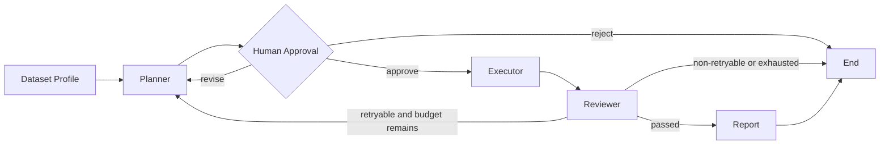

# DataPilot Agent 后端架构

## 核心流程



## 五个深模块

代码库使用少量深模块：每个模块对外接口较小，但隐藏内部复杂度。

| 模块 | 小型接口 | 隐藏的实现 |
|---|---|---|
| Dataset | `profile()`、`query()` | CSV/XLSX、DuckDB、结果截断 |
| Tool Runtime | `list_tools()`、`invoke()` | 参数校验、Guardrail、MCP、审计 |
| Agent Graph | `start()`、`resume()` | 节点、路由、Checkpoint、重试 |
| Artifact Store | `save()`、`load()` | 文件路径、摘要、大小限制 |
| Trace | `span()`、`export()` | 节点、模型、工具、token 和延迟 |

只有出现第二个真实实现时才引入 Adapter。例如 Fake LLM 和真实模型同时存在后，模型 seam 才是必要的；不会为了“分层”提前创建只有一个实现的空接口。

## AgentState 原则

AgentState 保存流程决策所需的小型信息：

- task、dataset 和用户问题
- 当前状态和步骤
- 结构化计划
- 工具结果摘要
- ArtifactRef
- Reviewer 结论
- 重试计数和错误

以下对象不得直接放入 State：

- DataFrame
- 完整 SQL 结果
- Plotly HTML
- 大型模型原文
- 本机绝对路径

这些内容由 Artifact Store 保存，State 只携带引用。这样 checkpoint 更小，也能控制进入模型的上下文。

## Guardrail 顺序

```text
Input Guardrail
→ Plan Guardrail
→ Tool Input Guardrail
→ Tool Execution
→ Tool Output Guardrail
→ Reviewer
→ Report Guardrail
```

安全拒绝不重试；模型格式错误和可修复工具错误允许在预算内修正。

## 不进入 v1.0 主线

- React 前端
- 任意 Python 代码执行
- Docker 沙箱
- A2A 远程 Agent 协作
- 长期个性化记忆
- 多租户、认证、计费和 Kubernetes

这些能力只有在核心工作流完成并且能够解释后才考虑扩展。
